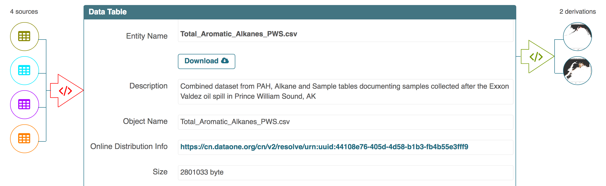
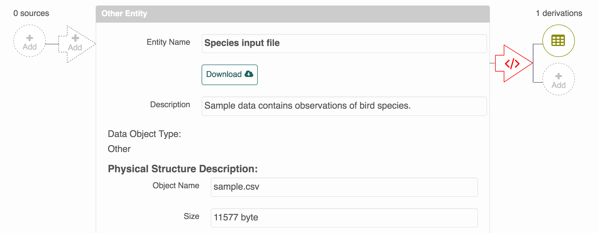
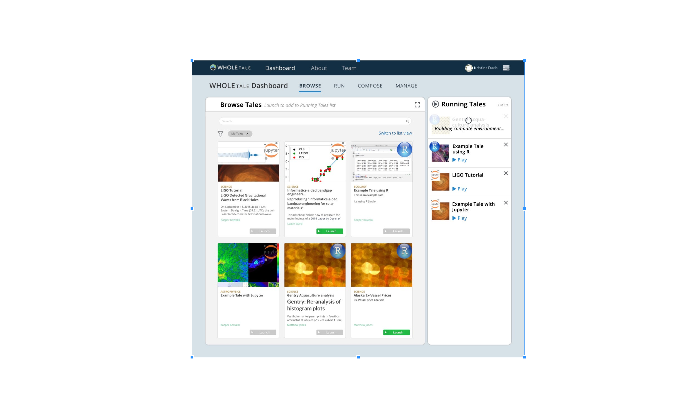

# Provenance tracking and display in DataONE

- Matt Jones and the DataONE provenance team
- National Center for Ecological Analysis and Synthesis
- DataONE

## Use Cases

[Provenance use cases](https://github.com/DataONEorg/sem-prov-design/blob/master/docs/use-cases/provenance/use-cases-summary.rst) in DataONE Center around the ability of researchers to document the origin and processing history of their scientific products, including the complete software workflow that was used to produce a set of science products.  The use cases include:

- Track execution history
- Describe workflow substeps
- Publish provenance in data packages
- Display provenance simply and clearly for researchers

Rickett's data package on [Soil bacterial communities](https://arcticdata.io/catalog/#view/doi:10.18739/A2556Q) is an example of a typical data package in the Arctic Data Center with a detailed provenance description of the relations among components of the package.

## ProvONE model and Data Package

The [ProvONE](http://purl.dataone.org/provone-v1-dev) model is an extension of W3C PROV with the goal of providing specializations of the main Activity and Entity classes to collect relevant information for fully specified scientific workflows.  In particular, provenance information centers around the `Execution` class, which binds together the execution of a computational script or program with its inputs and outputs using the standard `prov:used` and `prov:generatedBy` predicates, along with myriad others.


In DataONE, a [DataPackage](https://releases.dataone.org/online/api-documentation-v2.0.1/design/DataPackage.html) is a collection of objects that are published as a set and for which we record relationships in an OAI-ORE manifest.  Provenance information within DataONE is recorded in these ORE manifests and published with the data packages.  Here's a snippet of a provenance trace that is included with the [Carl's et al. Hydrocarbon data package](https://search.dataone.org/#view/urn:uuid:3249ada0-afe3-4dd6-875e-0f7928a4c171):

```ttl
<https://cn.dataone.org/cn/v2/resolve/urn%3Auuid%3Ab4b3cc45-4953-43d3-910a-847528577531>
  prov:wasGeneratedBy <urn:uuid:d248eca5-064f-4ee4-8c8c-59838fa94666> ;
  prov:wasDerivedFrom <https://cn.dataone.org/cn/v2/resolve/urn%3Auuid%3A44108e76-405d-4d58-b1b3-fb4b55e3fff9> ;
  ns1:isDocumentedBy <https://cn.dataone.org/cn/v2/resolve/urn%3Auuid%3A3249ada0-afe3-4dd6-875e-0f7928a4c171> ;
  dc:identifier "urn:uuid:b4b3cc45-4953-43d3-910a-847528577531"^^xsd:string ;
  ns0:isAggregatedBy <https://cn.dataone.org/cn/v2/resolve/urn%3Auuid%3A1d23e155-3ef5-47c6-9612-027c80855e8d#aggregation> ;
  a <http://purl.dataone.org/provone/2015/01/15/ontology#Data> .

<urn:uuid:d248eca5-064f-4ee4-8c8c-59838fa94666>
  dc:identifier "urn:uuid:d248eca5-064f-4ee4-8c8c-59838fa94666"^^xsd:string ;
  prov:qualifiedAssociation [
    a prov:Association ;
    prov:hadPlan <https://cn.dataone.org/cn/v2/resolve/urn%3Auuid%3A9490ce50-b7bc-4fe8-89d1-5b00736df835>
  ];
  prov:used <https://cn.dataone.org/cn/v2/resolve/urn%3Auuid%3A44108e76-405d-4d58-b1b3-fb4b55e3fff9> ;
  a <http://purl.dataone.org/provone/2015/01/15/ontology#Execution> .
```

Shown more concisely, provenance relationships in DataPackages can be visualized as simple relationships among the components:


## Provenance catalog display

This machine-readable provenance data needs to be converted into a display format that is approachable by researchers. We've consolidated on a display in which, for any given object, we display its immediate ancestors and immediate descendants in the provenance graph:



The circles on the left represent inputs, which are processed by the script execution symbolized by the left side arrow to produce the `Total_Aromatic_Alkanes_PWS.csv` integrated data file.  This file is in turn processed by another script that executes to produce two derived map images (prov:wasGeneratedBy).  In user testing, we found that researchers intuited these source and derivation relationships easily, and appreciated the understanding it provides on the relationships among the myriad objects in an unfamiliar data package.

## Provenance editing tools

### Web based editor
Creating provenance via the web leverages the same graphical display, but provides a properly authenticated user controls to add to the provenance graph:



### Provenance recording in R and Matlab

While manual assertions of provenance through the web are useful for small datasets, large data sources need scripted mechanisms establishing provenance.  We developed packages for R ([datapack](https://github.com/ropensci/datapack/), [recordr](https://github.com/NCEAS/recordr)) and Matlab ([matlab-dataone](https://github.com/dataoneorg/matlab-dataone)) to provide functions for both asserting and recording provenance.

*Asserting provenance.* In R, asserting provenance is done with `describeWorkflow()`, where the function takes identifiers for a set of inputs, a script or program, and a set of outputs, and generates the ProvONE statements that link these objects.  For example, here's the [describeWorkflow() call to provide provenance](https://nceas.github.io/sasap-training/materials/reproducible-analysis-in-r/data-documentation-and-publishing.html#publishing-data-from-r) within a script that creates a multi-object data package:

```r
# Add the provenance relationships to the data package
dp <- describeWorkflow(dp, sources=sourceObj, program=progObj, derivations=outputObj)
```

This makes it easy to add hundreds or thousands of provenance relationships when they are organized and uniform, which is often the case with large batch processed models.

*Recording provenance.* In addition to asserting provenance, we have also written [functions for recording program executions](https://github.com/NCEAS/recordr/blob/master/vignettes/intro_recordr.Rmd) that occur within R and Matlab. For each execution, we track the inputs and outputs that were read and written during that executed block.  This approach makes provenance an observable aspect of the system, rather than something that the investigator might assert, and greatly simplifies collecting provenance for researchers. Here's an example recording session for a single script:

```r
library(recordr)
rc <- new("Recordr")
sampleScript <- system.file("extdata/EmCoverage.R", package="recordr")
firstRunId <- record(rc, sampleScript , tag="first recordr run")
```

Although observing provenance is sensible in theory, in practive our usability tests have shown that researchers rarely if ever run a script from start to finish in one execution.  Instead, they tend to work interactively and execute segments of code from a script, often out of order and in a debug and test loop that allows each block of code to be iteratively refined.  Its never entirely clear which execution was the final one, and so our only choice is to record the whole interactive session (using `startRecord()` and `endRecord()`), but this produces extremely voluminous provenance traces with many false starts and unused code branches.  We've found that asserting provenance after a run is complete is the more effective.

## Whole Tale

The ProvONE model captures the details of scientific workflow executions, and in theory allows for full specifications of all dependencies.  In practice, this is difficult.   The [Whole Tale](http://wholetale.org) project is using metadata about executable docker containers to fully capture the computational environment that was in place when an execution occurs.  This allows the "Tale" to be reconstructed and re-executed in a complete reproducible environment.  These "Tales" extend the current DataONE packaging model with additional container metadata, and will be publishable as reproducible packages within the DataONE federation.



## Issues
- Reliable identification (URI versus identifiers)
    - Cross-repository linking
- Handling versioning
