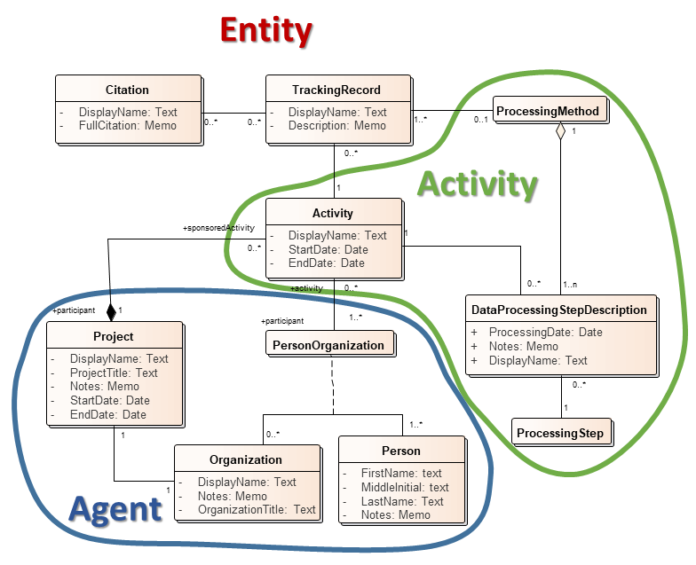

# Feature level prov tracking in databases

## Geologic maps:

Main use cases:

1. map assembled by team effort, final compiler commonly needs to know which mappers worked on a given area.

2. Compilation maps that bring data from various sources together, want to keep track of which lines and data came from which source, e.g. a statemap compilation. 

Database schema implements 'tracking record' that documents an activity responsible for origin of one or more features in the database. Two approaches are possible: the record can be linked to a some processing sequence as a sequence of processing steps with an activity responsible for each step, or the record can simply be linked to one activity. The activity is a binding between one or more persons, each of whom can be affiliated with an organization; the activity can also be bound to a project that sponsors the activity.  The tracking record can also bind the feature to a publication for data that are derived from the literature. 

Figure 1. Schema diagram for NGMDB tracking

Generation of the tracking records wasd incorporated into map digitization/compilation workflow using an ArcGIS Extension. The process was simplified by letting user set up a default record for a session that would automatically be associated with new features as they are digitized. 

It was found that creating the detailed processing step lineage was more work than the geologists were willing to do, given that the use cases for using that detail were not there. The processing steps are described in free text description on the tracking record. 

## National Geothermal Data System:

Multiple web services offering data from differnent geological surveys in same xml format to simplify integration of data.
Each feature or observation includes a URL for a source metadata record. In this case ISO 19139 xml records were generated for each data source, and the individual observations are linked to that record. The system would allow each feature to be linked with a separate metadata record that would include the full ISO19115 lineage model, but in practice this was never done, again because of the cost-benefit calculation.
